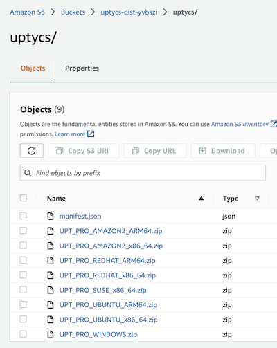

# Building Custom Distributor Packages with Uptycs
<!-- TOC -->
* [Automating Uptycs Agent Deployment Using AWS Systems Manager](#automating-uptycs-agent-deployment-using-aws-systems-manager)
  * [Introduction](#introduction)
  * [Prerequisities](#prerequisities)
  * [Implementing the solution](#implementing-the-solution)
    * [Clone this repository](#clone-this-repository)
    * [Create your Uptycs API credential file](#create-your-uptycs-api-credential-file)
    * [Create your distributor package](#create-your-distributor-package)
    * [Verify the Contents of the S3 Bucket](#verify-the-contents-of-the-s3-bucket)
    * [Deployment](#deployment)
    * [AWS CLI deployment](#aws-cli-deployment)
    * [AWS Console deployment](#aws-console-deployment)
  * [Verify Setup](#verify-setup)
  * [Testing the Solution](#testing-the-solution)
    * [StackSet Permissions Verification](#stackset-permissions-verification)
    * [Setting up a test Instance](#setting-up-a-test-instance)
<!-- TOC -->


## Introduction
This template automates the creation of an Uptycs Distributor package and a State Manager 
Association in multiple regions in a multiple orgainization accounts. 
The diagram below shows the setup process. 

- Step 1 - Create a s3 bucket and upload the Codepipeline source files.
- Step 2 - Add the cloudforamtion template to the master or delegated account in the org.
- Step 3 - The Cloudformation template will build a distributor packages in multiple regions in 
  the master account and share those packages with all organization member accounts. 
- Step 4 - User creates a stack instance of the Uptycs State Manager StackSet in the required 
  member accounts.


Once the setup process has completed you can add the State Manager Association to existing 
accounts following the procedure outlined [here](#stackset-permissions-verification)

New accounts will automatically be setup with the State Manager association as the StackSet will 
automatically be pushed to the new account during its creation as outlined in the diagram below. 

- Step 1 An EventBridge event rule triggers on a "CreateManagedAccount" event and sends the 
  event to a lambda function
- Step 2 The lambda function creates a StackSet stack instance to the new account and updates 
  the distributor package share information with the new AWS AccountId


## Prerequisities
The templates use *SELF_MANGED* StackSets.  It is assumed that the required roles have already 
been created.  For more information see the following link
https://docs.aws.amazon.com/AWSCloudFormation/latest/UserGuide/stacksets-prereqs-self-managed.html


## Implementing the solution

### Clone this repository
1. Create a local copy of this solution using the git clone command.

    ```shell
    git clone https://github.com/uptycslabs/aws-state-manager-org-cft
    
    ```
    
    This will download the required files and directories for the project
    
| Directory name          | Description                                                                                  |
|:------------------------|:---------------------------------------------------------------------------------------------|
| ssm-distributor-sources | Folders representing each supported OS and processor architecture                   |
| images                  | Images for supporting documentation                                                          |                                                                            |
| cloudformation          | Cloudformation files required to build the State Manager Association and Distributor package |                                                                            |

### Create your Uptycs API credential file
1. Download the API Credentials file from the Uptycs console.  
In your Uptycs Console, navigate to **Settings** -> **Users** -> **Create User** 
Select **Is Bot** and add the **Assets** group to the users
Select **Save**

    

2. Place the file in the `ssm-distributor` folder.  The credentials are required by the script to 
download the files from the Uptycs API and place them in the correct folder. 

### Create your distributor package

The `create_package.py` script will use information in the `agent_list.json` file to build zip 
files and a manifest.json file place them in a local s3-bucket folder and then upload them to an S3 bucket in your account.

    > Note: It is possible to create a custom distributor package, 

More information on building a custom package is provided [here](./additional-documents/CUSTOM-PACKAGES.md).

1. Navigate to the `ssm-distributor` folder and execute the `create_package.py` script.

2. Run the create_package.py script 
    ```shell
        cd ssm-distributor-sources
        python3 ./create_package.py -c <my-credentials-file> -b <my-bucket> -r <aws-region>   
    ```
   
    >Note: 
    **Mandatory Command line Arguments**
    > 
    > -c <my-credentials> The path to the credentials file that you downloaded in the previous section
    > 
    > **Optional Command line Arguments**
    > 
    >-b <my-bucket> The name of the S3 Bucket that you are going to create in your account. 
    >
    > -r <aws-region>  The region where the S3 bucket will be created.

    You can monitor the progress in the console.
    An example output is shown below (truncated output)


 
### Verify the Contents of the S3 Bucket

1. In your AWS Console navigate to **S3** -> **bucket name** and verify the contents of the bucket


    


### Deployment
AWS supports console or command line deployment for this solution.

The CloudFormation template takes the following parameters

| Parameter Name                 | Type                | Description                                                                                             | Default Value                |
|--------------------------------|---------------------|---------------------------------------------------------------------------------------------------------|------------------------------|
| EnabledRegions                 | CommaDelimitedList | Enter a comma-delimited list of regions where you wish to enable State Manager                          | -                            |
| EnableAllRegions               | String              | Create and Share Package in all regions                                                                 | -                            |
| AllowedValues:                 | 'true' or 'false'   |                                                                                                         |                              |
| ComplianceSeverity             | String              | The Severity to apply to the State Manager Alert                                                       | -                            |
| AdministrationRoleArn          | String              | Existing Stackset Administration Role Name                                                               | -                            |
| ExecutionRoleName              | String              | Existing Stackset Execution Role Name                                                                   | -                            |
| UptycsAgentTargetKey           | String              | Value of the Tag Key used to define the automation target                                                | SENSOR_DEPLOY                |
| UptycsAgentTargetValue         | String              | Value of the Tag Value used to define the automation target                                              | TRUE                         |
| UptycsSsmPackageBucketFolder   | String              | Uptycs folder in s3 bucket                                                                              | 'uptycs'                     |
| UptycsSsmPackageName           | String              | Uptycs Distributor package name                                                                         | 'UptycsAgent'                |
| UptycsSsmPackageBucket         | String              | SSM Distributor package that installs the Uptycs agent                                                   | -                            |
| UptycsScheduleRate             | String              | SSM association application cycle (minimum 30 minutes)                                                   | '60 minutes'                 |
| MaxConcurrency                 | String              | Percentage of total targets that SSM State Manager should run the SSM Automation concurrently           | '100%'                       |
| MaxErrors                      | String              | Error threshold percentage before                                                                      | '25%'                        |
| UptycsStateManagerStackSet     | String              | The name of the stackset that will be created                                                            | 'UptycsStateManagerStackSet' |


- [AWS CLI deployment](#aws-cli-deployment)
- [AWS Console deployment](#aws-console-deployment)

### AWS CLI deployment
You can deploy this stack using the AWS CLI from this folder using the following command.
Only required parameters are shown below, additional parameters may be added from the table above as necessary to meet the needs of your environment.

**Example** AWS cli command
```shell
aws cloudformation create-stack --stack-name 'Uptycs-State-Manger-Org' \
  --template-body file://Uptycs-State-Manager-org.yaml \
  --parameters ParameterKey= AdministrationRoleArn,ParameterValue='AWSCloudFormationStackSetAdministrationRole'  \
  ParameterKey= AdministrationRoleArn,ParameterValue='AWSCloudFormationStackSetExecutionRole'  \ 
  ParameterKey=UptycsSsmPackageBucketFolder,ParameterValue='my-bucket-name' \
  ParameterKey=EnabledRegions,ParameterValue='eu-west-1' \ParameterKey=ComplianceSeverity,ParameterValue='HIGH' \
  --region 'eu-west-1' --capabilities CAPABILITY_NAMED_IAM
```

### AWS Console deployment
To deploy this stack using the AWS console, follow the procedure below.

1. In your AWS Console, navigate to **CloudFormation** -> **Create stack** -> **With new resources (standard)**


2. Under **Specify template**, select **Upload a template file** and upload the 
   `Uptycs-State-Manager-org.yaml` from the cloudformation folder, then click **Next**

   


3. Provide a **Stack name** and update the **Parameters** section with the StackSet 
   administration and execution roles described earlier:

   


4. Select the regions where you would like the package deployed.  Either provide a list of 
   regions or select All Regions as **true**. Modify the Uptycs tags if required 
   and add the region list as required 
   **Next**.

   


5. Review your selections, and accpet the IAM warning `I acknowledge that AWS CloudFormation might 
   create IAM resources with custom names` check box. After doing so, click the **Create Stack** button.

   


6. Your stack will now start to deploy.
   Once completed your should see your original stack and also and an additional stack instance 
   from your stackset if you included this region in your regions list

   


## Verify Setup

1. In your AWS Console, navigate to **Systems Manager** -> **Distributor** -> **Owned by me** 
   and confirm that the package created successfully.  Confirm that the package has been shared 
   with other accounts in your org. 


    


3. In your AWS Console, navigate to a member account  **Systems Manager** -> **State 
   Manager** -> **Shared by me

   * State Manager Association
   


    
   

## Testing the Solution

Existing accounts can be setup by creating a stack instance in the account.   
Follow the procedure below to perfom an initial setup.

### StackSet Permissions Verification

Navigate to your AWS Organizations summary **Organizations** -> AWS Accounts
Copy either an account or OU in the summary page


Navigate to the StackSets Administration page **CloudFormation** -> **StackSets**


Navigate to **CloudFormation** -> **StackSets** -> **UptycsStateManagerStackSet** -> **StackSet details**
Select **Add Stacks to StackSet**


Enter either the target account or OU you selected from the earlier step


Verify that the Stack instance was created. 


### Setting up a test Instance 
A second cloudformation template `test-ec2-instance.yaml` is provided for testing and verification 
purposes. The template will create an EC2 instance in a test vpc with a systems manager profile 
attached.   The instance is tagged with the same default EC2 tags used in the setup template.  

To deploy this stack to a **member** account using the AWS console, follow the procedure below. 

1. In your AWS Console, navigate to **CloudFormation** -> **Create stack** -> **With new resources (standard)**

2. Under **Specify template**, select **Upload a template file** and upload the 
   `test-ec2-instance.yaml` from the cloudformation folder, then click **Next**


3. Verify that the State Manager Association has been triggered by the instance creation

Select the history tab to view the association history 


4. Select the instances tab to view the instances that the association has been applied to. 
