# Building Custom Distributor Packages with Uptycs
<!-- TOC -->
* [Building Custom Distributor Packages with Uptycs](#building-custom-distributor-packages-with-uptycs)
  * [Introduction](#introduction)
  * [Prerequisities](#prerequisities)
  * [Implementing the solution](#implementing-the-solution)
    * [Clone this repository](#clone-this-repository)
    * [Create your Uptycs API credential file](#create-your-uptycs-api-credential-file)
    * [Create the S3 bucket to stage your files](#create-the-s3-bucket-to-stage-your-files)
    * [Deployment](#deployment)
    * [AWS Console deployment](#aws-console-deployment)
  * [Verify Setup](#verify-setup)
    * [Systems Manager Package Creation](#systems-manager-package-creation)
  * [Testing the Solution](#testing-the-solution)
    * [Setting up a test Instance](#setting-up-a-test-instance)
<!-- TOC -->


## Introduction
This template automates the creation of an Uptycs Distributor package and a State Manager 
Association in multiple regions in a multiple orgainization accounts. 
The diagram below shows the setup process. 

- Step 1 - Create a s3 bucket and upload the Codepipeline source files.
- Step 2 - Add the cloudforamtion template to the master or delegated account in the org.
- Step 3 - The Cloudformation template will build a distributor packages in multiple regions in 
  the master account and share those packages with all organization member accounts. 
- Step 4 - User creates a stack instance of the Uptycs State Manager StackSet in the required 
  member accounts.


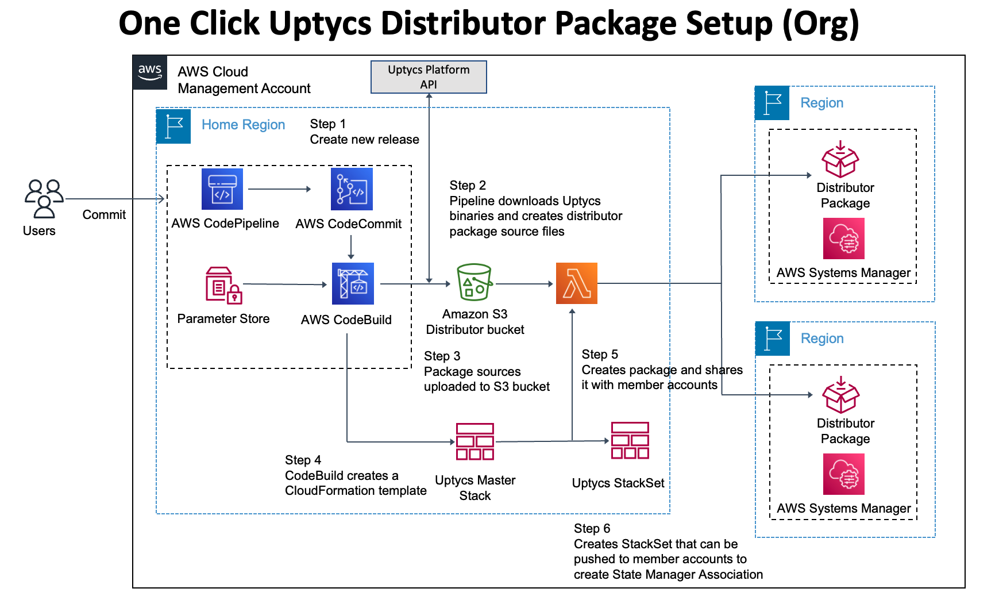


Once the setup process has completed you can add the State Manager Association to existing 
accounts following the procedure outlined [here](#stackset-permissions-verification)

New accounts will automatically be setup with the State Manager association as the StackSet will 
automatically be pushed to the new account during its creation as outlined in the diagram below. 

- Step 1 An EventBridge event rule triggers on a "CreateManagedAccount" event and sends the 
  event to a lambda function
- Step 2 The lambda function creates a StackSet stack instance to the new account and updates 
  the distributor package share information with the new AWS AccountId


## Prerequisities
The templates use *SELF_MANGED* StackSets.  It is assumed that the required roles have already 
been created.  For more information see the following link
https://docs.aws.amazon.com/AWSCloudFormation/latest/UserGuide/stacksets-prereqs-self-managed.html


## Implementing the solution

### Clone this repository
1. Create a local copy of this solution using the git clone command.

    ```shell
    git clone https://github.com/jharris-uptycs/uptycs-ssm-self-build.git
    
    ```
    
    This will download the required files and directories for the project
    
| Directory name               | Description                                                                                  |
|:-----------------------------|:---------------------------------------------------------------------------------------------|
| codepipeline                 | Images for supporting documentation                                                          |                                                                            
| s3bucket                     | Cloudformation files required to build the State Manager Association and Distributor package |                                                                            

### Create your Uptycs API credential file
1. Download the API Credentials file from the Uptycs console.  
In your Uptycs Console, navigate to **Settings** -> **Users** -> **Create User** 
Select **Is Bot** and add the **Assets** group to the users
Select **Save**

    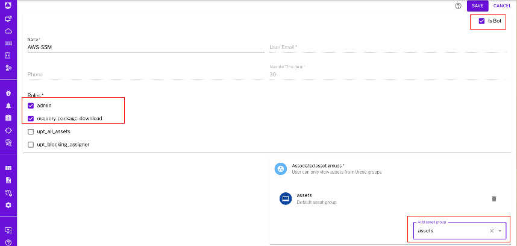

2. Place the file in the `ssm-distributor` folder.  The credentials are required by the script to 
download the files from the Uptycs API and place them in the correct folder. 

### Create the S3 bucket to stage your files

Create an S3 bucket and upload the contents of the s3bucket folder to the bucket.  Modify the 
bucket permissions to make the `/templates/Uptycs-State-Manager-aws-org-v3.yaml` public read-only.


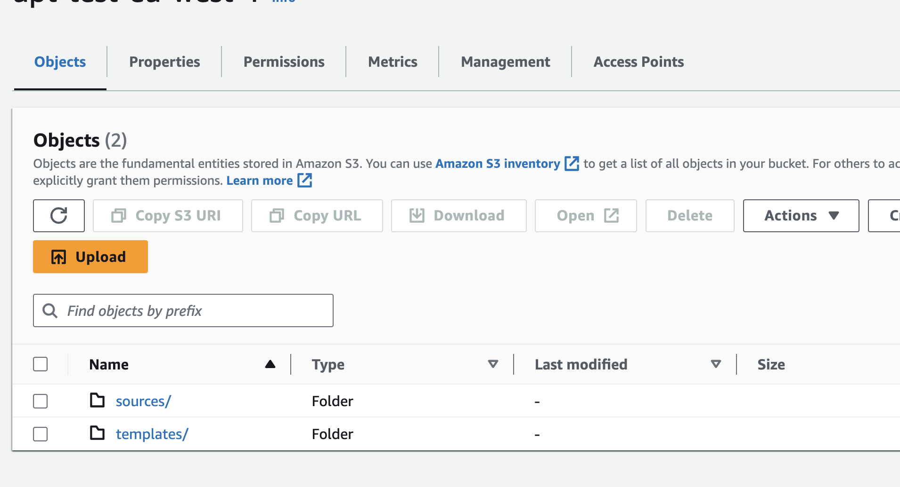


Set the public read-only permissions
    
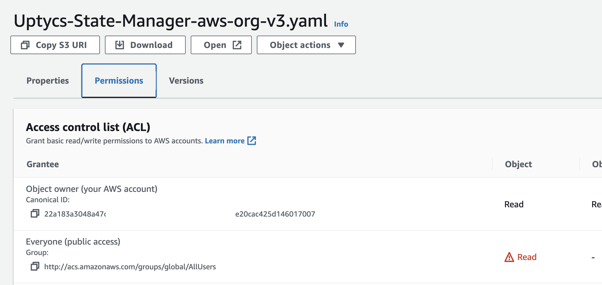


### Deployment
AWS supports console or command line deployment for this solution.

The CloudFormation template takes the following parameters


| Parameter Name            | Description                                                                                                                                               |
|---------------------------|-----------------------------------------------------------------------------------------------------------------------------------------------------------|
| UptycsTemplateName        | The name of the Uptycs primary account template                                                                                                           |
| EnableAllRegions          | Allowed Values true false. Set to true to enable or regions or false and specify a region list in Enabled regions                                        <br/> |
| EnabledRegions            | Add a list of regions if you have set EnableAllRegions to False.                                                                                          |
| ComplianceSeverity        | The Severity to apply to the State Manager Alert                                                                                                          |
| UptycsAgentTargetKey      | Value of the Tag Key used to define the automation target                                                                                                 |
| UptycsAgentTargetValue    | Value of the Tag Value used to define the automation target                                                                                               |
| AdministrationRoleArn     | Existing Stackset Administration Role ARN. For example ControlTower uses arn:aws:iam::<accountId>:role/service-role/AWSControlTowerStackSetRole           |
| ExecutionRoleName         | Existing Stackset Execution Role Name. For example ControlTower uses AWSControlTowerExecution                                                             |
| UptycsKeysParameterStoreName | Uptycs API Key Parameter Store Name                                                                                                                       |
| UptycsAPIKey              | Uptycs API Key                                                                                                                                            |
| UptycsSecret              | Uptycs API Secret                                                                                                                                         |
| UptycsCustomerId          | Uptycs API CustomerId                                                                                                                                     |
| UptycsDomain              | Uptycs Domain                                                                                                                                             |
| RepositoryName            | CodeCommit Repository for Uptycs CloudFormation templates                                                                                                 |
| RepositoryDescription     | CodeCommit repository description                                                                                                                         |
| BranchName                | Branch in the CodeCommit Repository for Uptycs CloudFormation templates                                                                                   |
| UptycsSsmPackageBucket    | Prefix for the S3 Staging Bucket that stages the code copied from code commit                                                                             |
| S3CodeBucketName          | Name of the S3 bucket with the initial commit of code                                                                                                     |
| S3Prefix                  | Prefix for file path                                                                                                                                      |
| S3CodeBucketKey           | Key of the S3 bucket with the initial commit of code                                                                                                      |

- [AWS Console deployment](#aws-console-deployment)


### AWS Console deployment
To deploy this stack using the AWS console, follow the procedure below.

1. In your AWS Console, navigate to **CloudFormation** -> **Create stack** -> **With new resources (standard)**


2. Under **Specify template**, select **Upload a template file** and upload the 
   `uptycs-ssm-codepipeline-build.yml` from the cloudformation folder, then click **Next**


3. Provide a **Stack name** and update the **Parameters**  


4. Select the regions where you would like the package deployed.  Either provide a list of 
   regions or select All Regions as **true**. Modify the Uptycs tags if required 
   and add the region list as required 
   **Next**.


5. Review your selections, and accpet the IAM warning `I acknowledge that AWS CloudFormation might 
   create IAM resources with custom names` check box. After doing so, click the **Create Stack** button.

   
6. Your stack will now start to deploy.
   Once completed you should see your original stack and also and an additional stack instance
   from your stackset if you included this region in your regions list


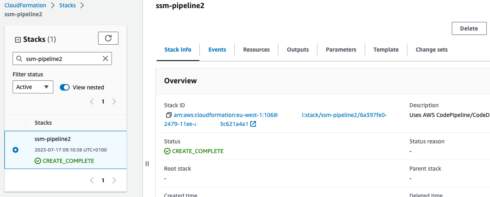


## Verify Setup

### Systems Manager Package Creation

The template creates a CodePipeline project to build a distributor package from the sources 
previously uploaded to the S3 bucket and then creates a distributor package in one or more regions.


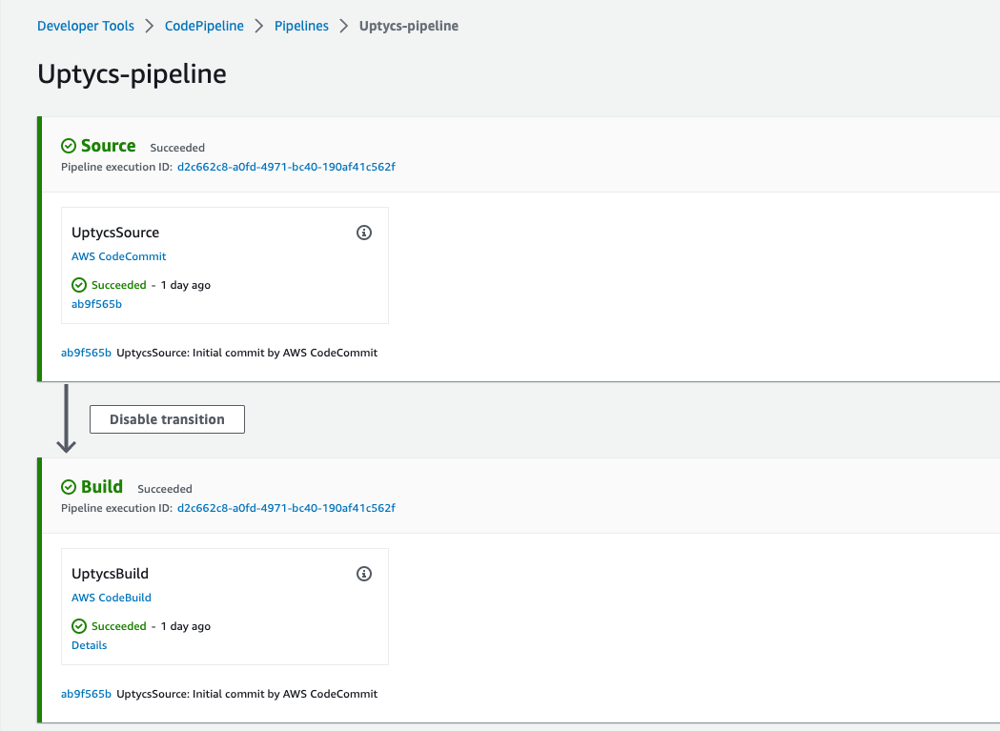


The template will create the following resourcesIn your AWS Console, navigate to **Systems 
Manager** -> **Distributor** -> **Owned by me** and confirm that the package created 
successfully.  Confirm that the package has been shared with other accounts in your org. 

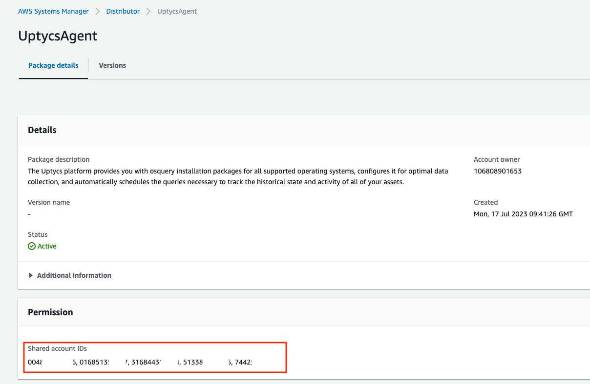

Package details


In your AWS Console, navigate to a member account  **Systems Manager** -> **State Manager** -> **Shared by me


State Manager Association


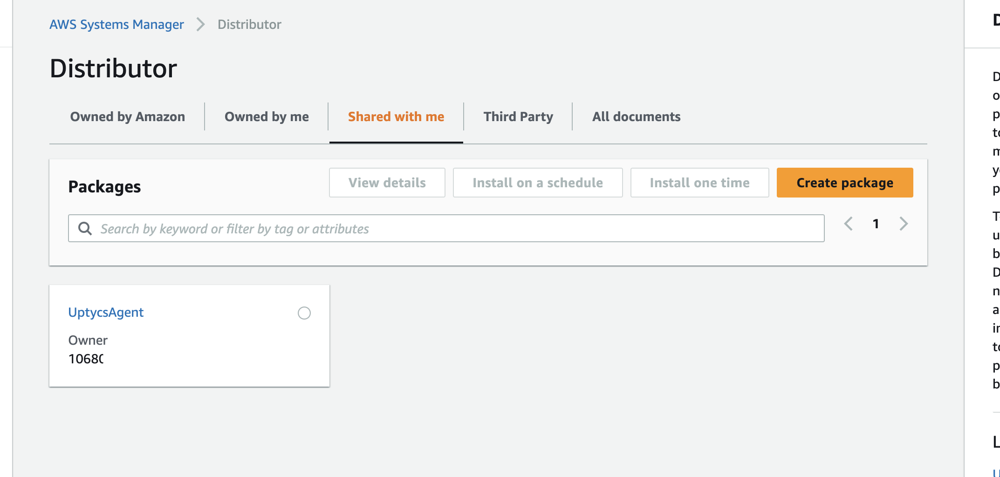
   

## Testing the Solution

Existing accounts can be setup by creating a stack instance in the account.   
Follow the procedure below to perform an initial setup.


Navigate to the StackSets Administration page **CloudFormation** -> **StackSets**

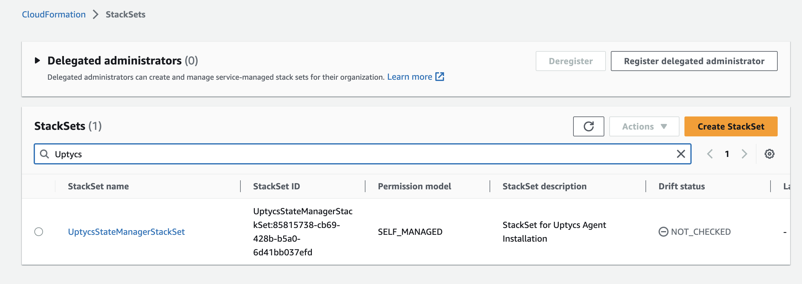


Navigate to **CloudFormation** -> **StackSets** -> **UptycsStateManagerStackSet** -> **StackSet details**
Select **Add Stacks to StackSet**

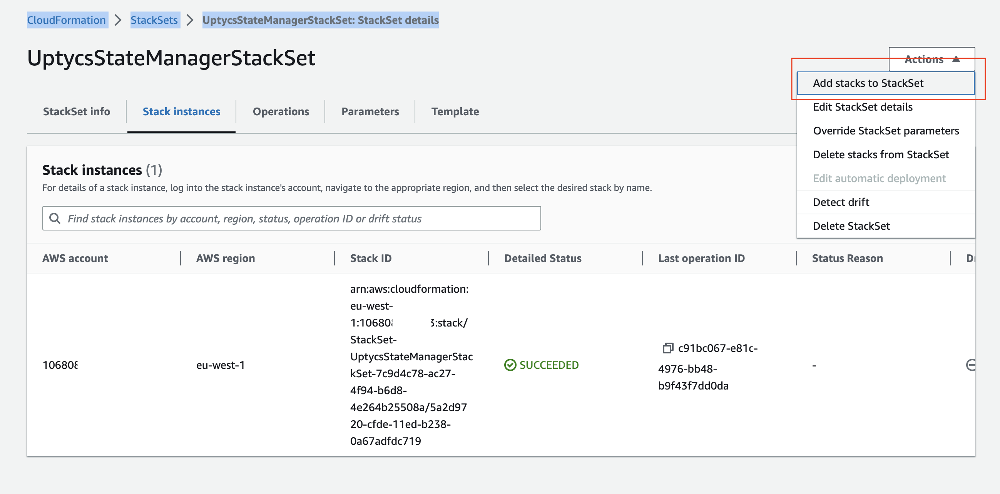


Enter either the target account or OU you selected from the earlier step

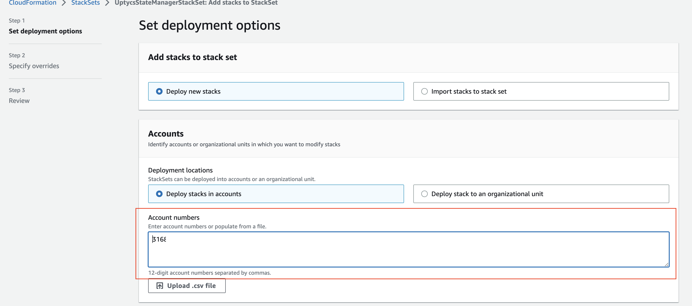


Verify that the Stack instance was created. 


### Setting up a test Instance 
A second cloudformation template `test-ec2-instance.yaml` is provided for testing and verification 
purposes. The template will create an EC2 instance in a test vpc with a systems manager profile 
attached.   The instance is tagged with the same default EC2 tags used in the setup template.  

To deploy this stack to a **member** account using the AWS console, follow the procedure below. 

1. In your AWS Console, navigate to **CloudFormation** -> **Create stack** -> **With new resources (standard)**

2. Under **Specify template**, select **Upload a template file** and upload the 
   `test-ec2-instance.yaml` from the cloudformation folder, then click **Next**

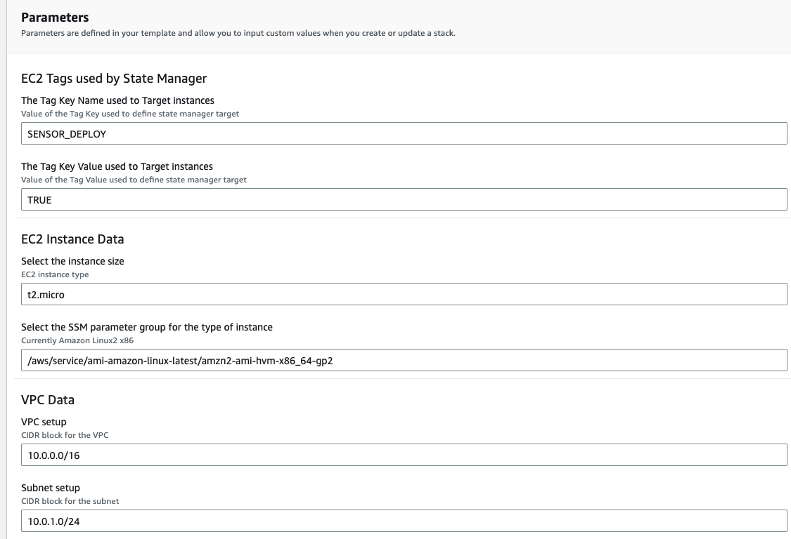

3. Verify that the State Manager Association has been triggered by the instance creation

Select the history tab to view the association history 
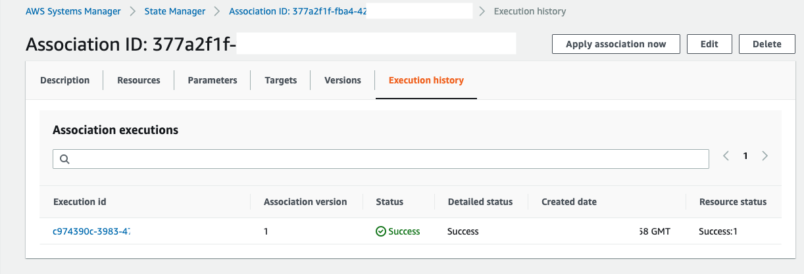

4. Select the instances tab to view the instances that the association has been applied to. 
